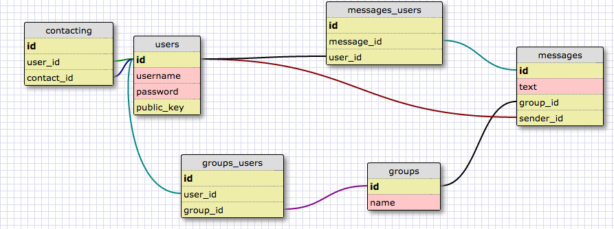

#BumbleBuzz Chat

##Description

BumbleBuzz is meant to be an individual/group chat client that allows users to log in to the server, and view ongoing conversations between themselves and other individuals or groups. I envision the MVP as including only a single group of all users, producing one single conversation between all users.

## Current Status

I have created a database modeling the basic functionality. Ultimately, the schema may expand to include separate conversations involving the same user(s), but for the moment it stores only users, their contacts, groups, and messages:

Additionally, I have used Sinatra to create a bare-bones index that prompts the user for authentication. If authentication fails, the user is re-prompted. If successful, the user is redirected to the welcome page, which currently displays a wishlist of features. A browser session is established in order to ensure access is only granted to a properly-authenticated user.

## How Can You Help?

Clearly this project needs a lot of work. It needs at least the following:
* HTML for the welcome page to display the necessary information and accept input from the user.
* ruby to locate the appropriate messages and pass them to the front end
* ruby to accept new input from the user, and write it to the database
* ruby to refresh the browser in order to display new incoming messages
* ruby to properly log the user out and delete the session

Feel free to tackle any/all of these issues. If you create your own branch, you can push it to this repository, and submit a pull request into my branch. Or, if you prefer, contact me to discuss any aspects or components that interest you. I can be reached via email, slack, or phone (which is listed on slack).

Thanks in advance for any and all work you can contribute!
